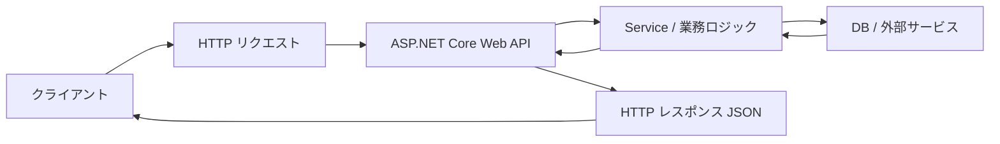

# ASP.NET Core Web API とは何か

ASP.NET Core Web API は、HTTP を通じてデータや処理を公開するための ASP.NET Core の作り方です。

ブラウザーに HTML を返す MVC アプリとは違い、Web API は主に **JSON などのデータ** を返します。フロントエンド、スマートフォンアプリ、別のサーバーなどから呼び出されます。

```csharp
app.MapGet("/health", () => Results.Ok(new { status = "ok" }));
```

ASP.NET Core Web API では、ルーティング、モデルバインディング、DI、認証、ログ、OpenAPI などを組み合わせて API を作ります。



Web API は、外部からの HTTP リクエストを受け取り、アプリ内部の処理へ橋渡しし、結果を HTTP レスポンスとして返す入口です。
