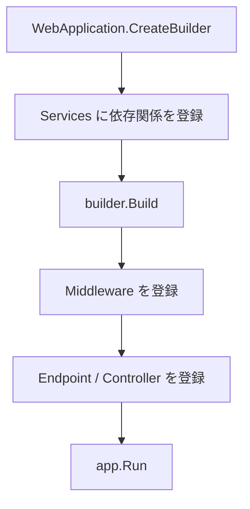

# Program.cs の役割

ASP.NET Core の `Program.cs` は、アプリの起動処理を書くファイルです。

主な役割は次の 3 つです。

- `WebApplicationBuilder` を作る
- DI、設定、ログなどのサービスを登録する
- ミドルウェアとエンドポイントを定義する

```csharp
var builder = WebApplication.CreateBuilder(args);

var app = builder.Build();

app.MapGet("/", () => "Hello API");

app.Run();
```

`Program.cs` は小さく保ち、処理が増えたら別のクラスや拡張メソッドへ分けます。



`builder` の段階では部品を登録し、`app` の段階ではリクエスト処理の流れを作る、と分けて見ると理解しやすくなります。
