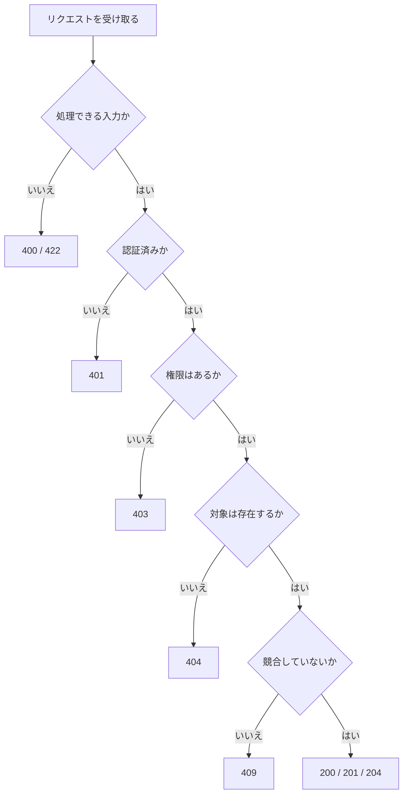

# 実務でよく使うステータスコード

実務で最初に覚えるべきステータスコードは多くありません。

| 状況 | ステータスコード |
| --- | --- |
| 取得成功 | `200 OK` |
| 作成成功 | `201 Created` |
| 更新成功 | `200 OK` または `204 No Content` |
| 削除成功 | `204 No Content` |
| 入力エラー | `400 Bad Request` または `422 Unprocessable Content` |
| 未認証 | `401 Unauthorized` |
| 権限不足 | `403 Forbidden` |
| 対象なし | `404 Not Found` |
| 重複や競合 | `409 Conflict` |
| 予期しないサーバーエラー | `500 Internal Server Error` |

迷ったら、レスポンスを受け取るクライアントが **次に何を判断できるか** を考えます。

ステータスコードは飾りではなく、API の契約の一部です。

## 迷いやすい例

作成成功は、単に処理が成功しただけなら `200 OK` でも表現できます。しかし、新しいリソースが作られたことを伝えたいなら `201 Created` が適しています。

```csharp
return Results.Created($"/api/articles/{article.Id}", response);
```

削除成功は、削除後に返す本文がなければ `204 No Content` が自然です。

```csharp
return Results.NoContent();
```

入力エラーは、チームで `400 Bad Request` に寄せる設計が多いです。JSON の形式は正しいが、業務的に処理できない入力を `422 Unprocessable Content` として分ける設計もあります。

```text
400: title が空、JSON が壊れている、型が違う
422: 開始日が終了日より後、業務上選べない状態
```

未認証と権限不足も混同しやすいです。

```text
401: ログインしていない、トークンがない、トークンが無効
403: ログイン済みだが、その操作をする権限がない
```

重複登録や更新競合は `409 Conflict` が候補になります。

```text
POST /users
email が既に使われている -> 409 Conflict
```

ステータスコードの選択は、完全な正解を暗記するより、プロジェクト内で一貫したルールを作ることが重要です。



実際の API ではこの順番が必ず固定ではありませんが、どの種類の失敗なのかを分けて考える助けになります。
