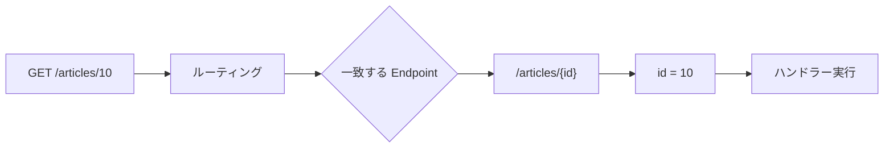

# ルーティングとは

ルーティングは、リクエストされた URL と HTTP メソッドを、実行する処理に結び付ける仕組みです。

Minimal API では `MapGet` や `MapPost` でルートを定義します。

```csharp
app.MapGet("/articles", () => articles);
app.MapGet("/articles/{id}", (int id) => articles.Find(id));
```

Controller では `[Route]` や `[HttpGet]` などの属性で定義します。



ルーティングは、URL 文字列を単に分解するだけでなく、どの処理を実行するかを決める仕組みです。
