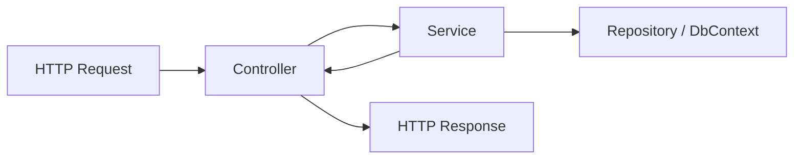

# Controller の責務

Controller は、HTTP とアプリ内部の境界です。

Controller に置くもの:

- HTTP メソッドとルート
- Request DTO の受け取り
- Service の呼び出し
- Service の結果をステータスコードへ変換
- Response DTO の返却

Controller に置きすぎないもの:

- 複雑な業務ルール
- DB への細かい問い合わせ
- Entity と DTO の大量の変換
- 外部 API 呼び出しの詳細
- トランザクション制御の詳細

Controller は薄く、Service に業務判断を寄せると、テストしやすく変更にも強くなります。

