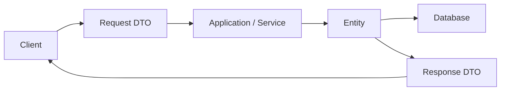

# DTO とは何か

DTO は Data Transfer Object の略で、API の入出力としてデータを運ぶための型です。

Entity が内部の業務データや DB 構造を表すのに対して、DTO は **外部との契約** を表します。

例えば、ユーザーを返す API では、DB には `PasswordHash` や `DeletedAt` があっても、レスポンス DTO には公開したい項目だけを持たせます。

```csharp
public sealed record UserResponse(
    int Id,
    string Name,
    string Email);
```

DTO を使うと、API で受け取る形と返す形を明示できます。



DTO は、Controller の都合だけでなく、API を使う側との約束を安定させるために使います。
