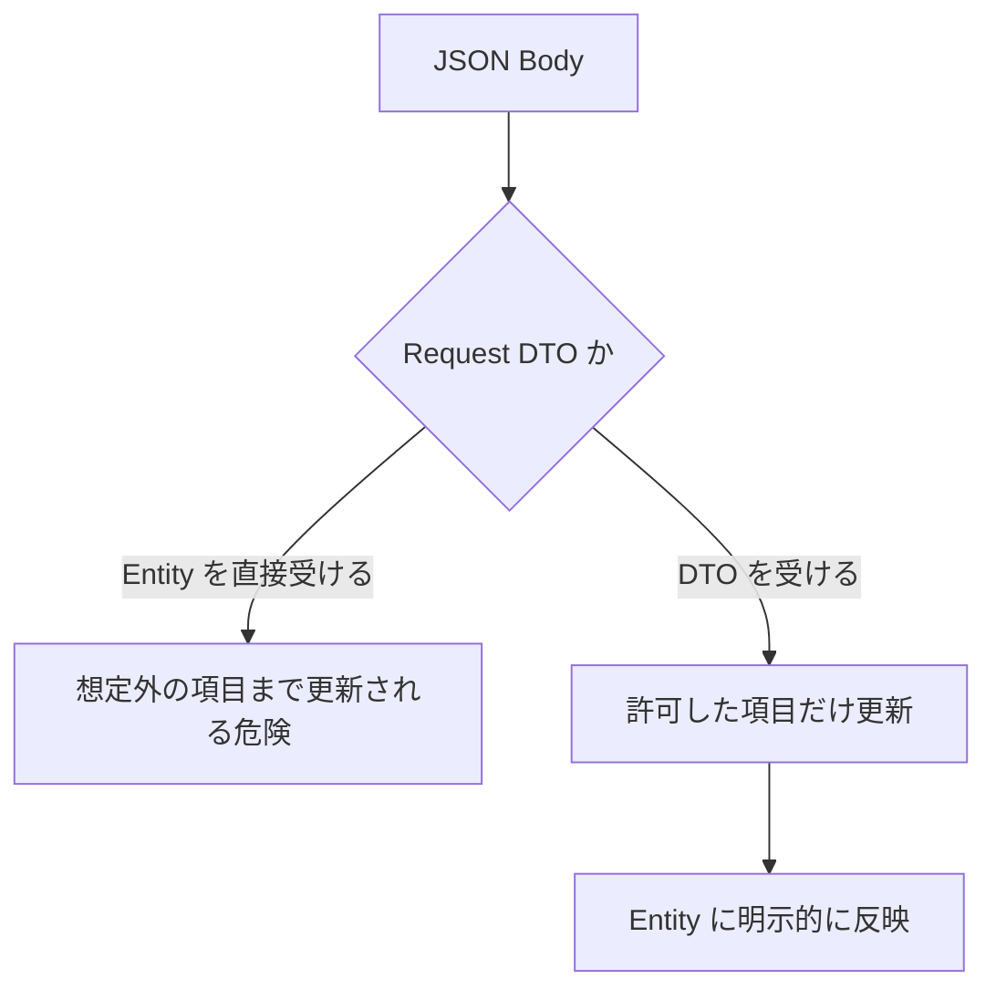

# 過剰投稿と Mass Assignment

過剰投稿と Mass Assignment は、クライアントが送った想定外のプロパティまで更新されてしまう問題です。

例えば、ユーザー更新 API で Entity をそのまま受け取ると、クライアントが `IsAdmin` を送って管理者権限を変更できてしまう危険があります。

```csharp
public class User
{
    public int Id { get; set; }
    public string Name { get; set; } = "";
    public string Email { get; set; } = "";
    public bool IsAdmin { get; set; }
}
```

```json
{
  "name": "Taro",
  "email": "taro@example.com",
  "isAdmin": true
}
```

対策は、更新を許可する項目だけを持つ Request DTO を使うことです。

```csharp
public sealed record UpdateUserRequest(
    string Name,
    string Email);
```



**外部から変更できる項目は DTO で絞る**、これが Mass Assignment 対策の基本です。
