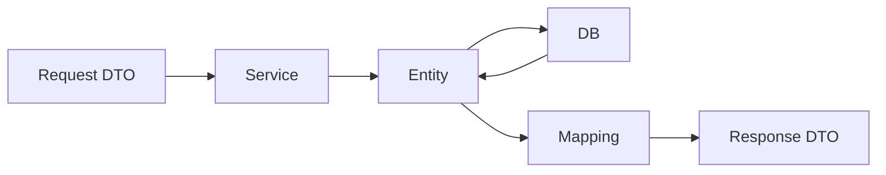

# Entity をそのまま返してはいけない理由

Entity をそのまま API レスポンスに返すと、内部構造を外部に公開してしまいます。

問題になりやすい点は次の通りです。

- DB の列やリレーションが外部仕様になってしまう
- 内部用の項目を返してしまう
- 循環参照で JSON シリアライズに失敗する
- DB 変更が API 破壊的変更になりやすい
- 想定外のプロパティ更新につながる

API では、外部に見せる形を Response DTO として明示します。

Entity は内部モデル、DTO は外部契約です。

## 具体例

次のような Entity があるとします。

```csharp
public class User
{
    public int Id { get; set; }
    public string Email { get; set; } = "";
    public string PasswordHash { get; set; } = "";
    public bool IsAdmin { get; set; }
    public List<Order> Orders { get; set; } = [];
}
```

この Entity をそのまま返すと、`PasswordHash` や `IsAdmin` のような内部情報まで外に出る危険があります。`Orders` からさらに関連 Entity がつながり、レスポンスが大きくなったり循環参照になったりすることもあります。

外部に返したい形だけを Response DTO にします。

```csharp
public record UserResponse(
    int Id,
    string Email
);
```

更新時も同じです。Entity をそのまま受け取ると、クライアントが `IsAdmin` を送って管理者権限を変更できてしまうような事故につながります。

```csharp
public record UpdateUserRequest(
    string Email
);
```

Request DTO は「外部から変更を許可する項目」、Response DTO は「外部へ公開する項目」と考えます。



外から入る形、内部で扱う形、外へ返す形を分けることで、API の契約と DB 構造を切り離せます。
