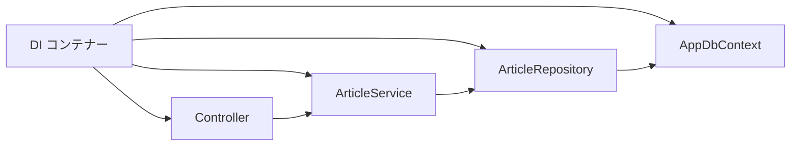

# DI とは

DI は Dependency Injection の略で、必要な依存オブジェクトを外から渡す仕組みです。

ASP.NET Core には DI コンテナーが組み込まれています。

```csharp
builder.Services.AddScoped<ArticleService>();

app.MapGet("/articles", (ArticleService service) => service.GetAll());
```

DI を使うと、実装の差し替え、テスト、責務の分離がしやすくなります。



自分で `new` して依存関係を作るのではなく、必要な部品を DI コンテナーから渡してもらいます。
