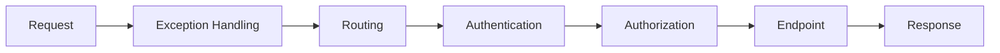

# パイプライン

ASP.NET Core のリクエスト処理はパイプラインと呼ばれます。

リクエストは登録されたミドルウェアを順番に通り、レスポンスは逆方向に戻ります。

```csharp
app.UseExceptionHandler();
app.UseRouting();
app.UseAuthentication();
app.UseAuthorization();
app.MapControllers();
```

認証より前に認可を置くと正しく動かないように、順番には意味があります。



ミドルウェアはリクエストの通り道です。前に置いた処理ほど、後続の処理全体に影響します。
