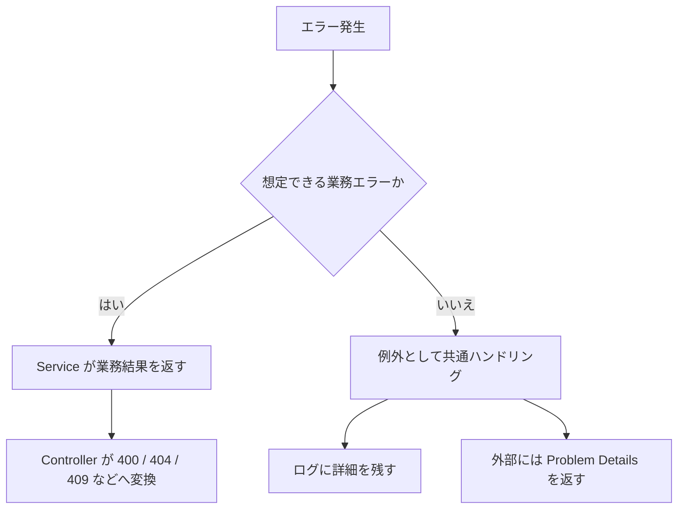

# 業務エラーとシステムエラー

業務エラーは、業務ルール上その操作を受け付けられない状態です。

例:

- メールアドレスが重複している
- 在庫が足りない
- すでにキャンセル済みの注文をキャンセルしようとした

システムエラーは、アプリやインフラ側の予期しない失敗です。

例:

- DB に接続できない
- 外部 API が落ちている
- 未処理例外が発生した

業務エラーは `400`、`404`、`409` などに変換します。システムエラーは外部へ詳細を出さず、`500` として扱います。

## 業務エラーは例外にしすぎない

業務エラーは、アプリとして想定できる結果です。

例えば、メールアドレスの重複、対象データなし、権限不足は、API で普通に起こり得ます。

このようなケースをすべて例外として扱うと、正常な分岐と異常事態の区別がつきにくくなります。

```csharp
if (await userRepository.ExistsByEmailAsync(request.Email))
{
    return RegisterUserResult.Conflict("Email already exists.");
}
```

Service では業務上の結果を返し、Controller やエンドポイントで HTTP レスポンスへ変換すると整理しやすいです。

```csharp
return result switch
{
    RegisterUserSuccess success => Results.Created($"/users/{success.UserId}", success),
    RegisterUserConflict conflict => Results.Conflict(conflict.Message),
    _ => Results.StatusCode(500)
};
```

## システムエラーは共通処理に寄せる

DB 接続失敗や未処理例外は、個別の API ごとに同じ `try-catch` を書くより、例外ハンドリングミドルウェアでまとめて扱います。

外部には汎用的な Problem Details を返し、ログには調査に必要な詳細を残します。

```text
レスポンス: An unexpected error occurred.
ログ: 例外型、メッセージ、スタックトレース、TraceId
```

ユーザーに返す情報と、開発者・運用者が見る情報は分けます。



業務エラーとシステムエラーを分けると、レスポンス設計とログ設計が整理しやすくなります。
