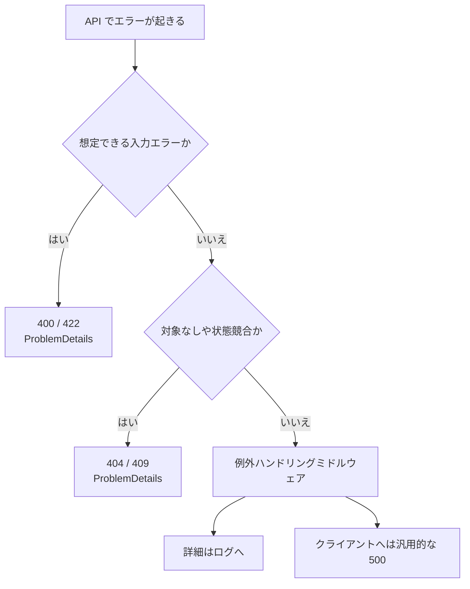

# API の例外処理

API では、未処理例外の詳細をそのままクライアントへ返さないようにします。

本番でスタックトレースや内部情報を返すと、セキュリティや運用上の問題になります。

```csharp
app.UseExceptionHandler();
```

想定できるエラーは、例外ではなく `400`、`404`、`409` などのレスポンスとして返す方が分かりやすい場面もあります。

エラー設計では、入力エラー、業務エラー、システムエラーを分けます。

| 種類 | 例 | 返し方 |
| --- | --- | --- |
| 入力エラー | 必須項目がない、文字数が長い | `400` と ProblemDetails |
| 業務エラー | 重複、状態不正、競合 | `400` / `404` / `409` など |
| システムエラー | DB 障害、未処理例外 | 汎用的な `500` |



詳細はログに残し、レスポンスには外部へ見せてよい情報だけを返します。
