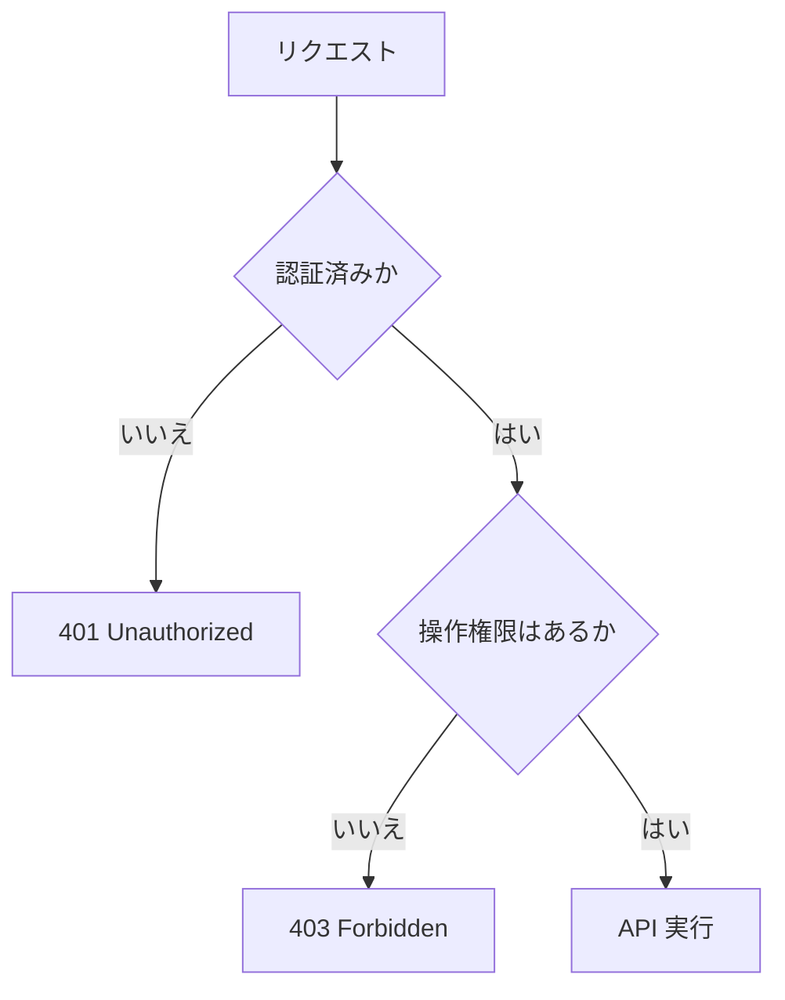

# 認証と認可の違い

認証は「誰か」を確認することです。認可は「何をしてよいか」を確認することです。

例:

- 認証: ログインしているユーザーか
- 認可: 管理者だけが削除できるか

ASP.NET Core では `UseAuthentication` と `UseAuthorization` を使います。

```csharp
app.UseAuthentication();
app.UseAuthorization();
```

認証してから認可するため、通常はこの順番で登録します。



認証は「誰か」、認可は「その人が何をしてよいか」を確認します。
