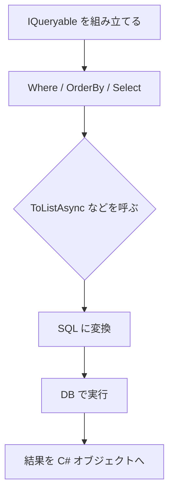

# LINQ で DB 問い合わせを書くときの注意

EF Core の LINQ は、最終的に SQL に変換されます。

```csharp
var articles = await db.Articles
    .Where(article => article.Published)
    .OrderByDescending(article => article.CreatedAt)
    .ToListAsync();
```

すべての C# の処理が SQL に変換できるわけではありません。変換できない処理を混ぜると、実行時エラーや意図しないメモリ上処理につながります。

DB で絞り込むべき条件は、`ToListAsync` の前に書きます。

**いつ SQL が実行されるか** を意識することが大切です。



`ToListAsync` より前に条件を書くと DB 側で絞り込めます。後ろに書くと、取得後のメモリ上処理になりやすくなります。
