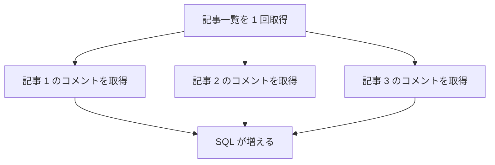

# N+1 問題

N+1 問題は、一覧取得の後に関連データを 1 件ずつ取りに行ってしまう問題です。

例えば、記事一覧を取得した後、各記事のコメント数を個別に問い合わせると、記事数分の SQL が追加で発行されます。

対策には次のような方法があります。

- `Include` で関連データを読み込む
- `Select` で必要な形に射影する
- 集計用のクエリを別に作る

```csharp
var articles = await db.Articles
    .Select(article => new ArticleResponse(
        article.Id,
        article.Title,
        article.Comments.Count))
    .ToListAsync();
```

API のレスポンス設計と DB 問い合わせはセットで考えます。



N+1 は小さいデータでは気づきにくく、本番データ量で急に遅くなることがあります。API の一覧取得では特に注意します。
