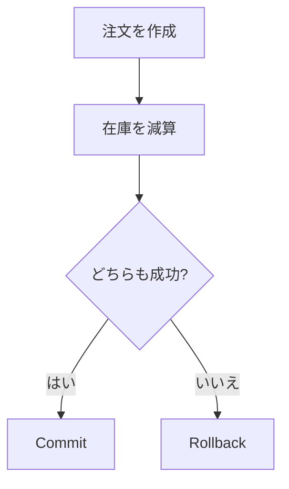

# トランザクション

トランザクションは、複数の DB 操作をひとまとまりとして扱う仕組みです。

すべて成功したら確定し、途中で失敗したら元に戻します。

```csharp
await using var transaction = await db.Database.BeginTransactionAsync();

// 複数の更新処理

await db.SaveChangesAsync();
await transaction.CommitAsync();
```

1 回の `SaveChangesAsync` 内の変更は、通常トランザクションとして扱われます。

複数回の保存や外部処理を含む場合は、どこまでを同じトランザクションにするか慎重に決めます。

例えば、注文作成と在庫減算を別々に保存して片方だけ成功すると、データの整合性が壊れます。



外部 API 呼び出しやメール送信まで DB トランザクションに含めると、ロック時間が長くなります。DB で守る整合性と、後続処理で扱う処理を分けて考えます。
