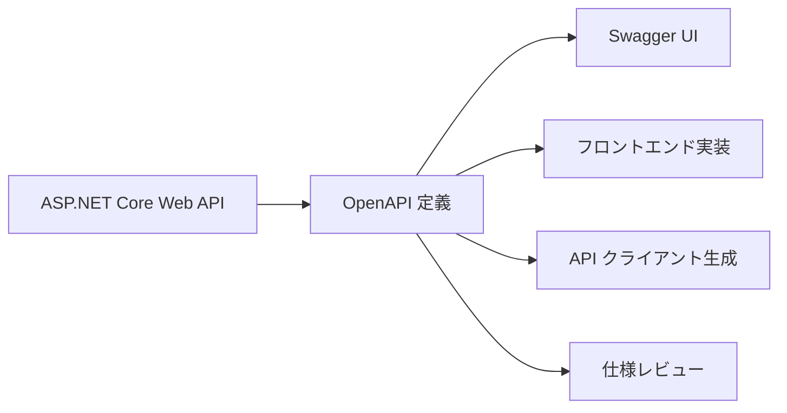

# OpenAPI とは

OpenAPI は、HTTP API の仕様を機械が読める形式で表すための仕様です。

エンドポイント、リクエスト、レスポンス、認証方式などをドキュメント化できます。

ASP.NET Core では、OpenAPI を生成して Swagger UI で確認する構成がよく使われます。

OpenAPI は **API 利用者との契約** として役立ちます。

OpenAPI はブラウザーで見るドキュメントだけでなく、実装・レビュー・自動生成にも使える仕様です。
