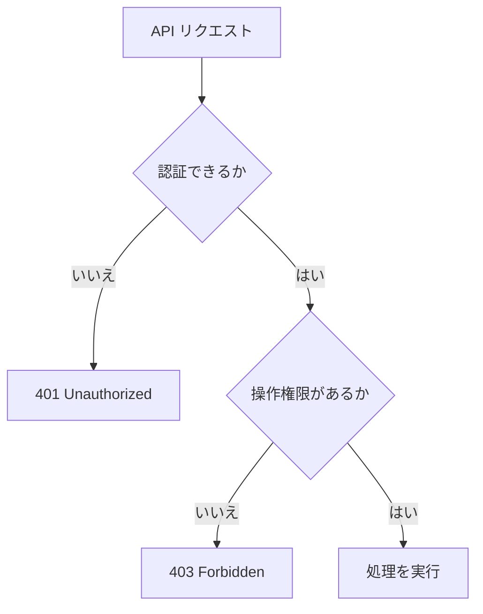

# 401 と 403 の違い

`401 Unauthorized` は、認証できていないときに返します。

`403 Forbidden` は、認証はできているが、その操作を行う権限がないときに返します。

| 状態 | 返すステータス |
| --- | --- |
| ログインしていない | `401 Unauthorized` |
| トークンがない | `401 Unauthorized` |
| トークンが無効 | `401 Unauthorized` |
| 一般ユーザーが管理者 API を呼んだ | `403 Forbidden` |
| 他人のデータを更新しようとした | `403 Forbidden` |
| 契約プラン上使えない機能を呼んだ | `403 Forbidden` |

ログインできることより、権限のない操作を防げることの方が重要です。
