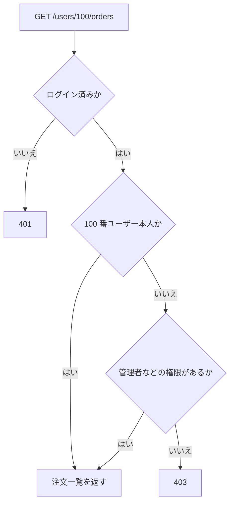

# 認可チェック漏れ

認可チェック漏れは、ユーザーが本来アクセスできないデータや操作にアクセスできる状態です。

危険な例:

```text
GET /users/100/orders
```

ログインしていても、`100` 番のユーザー本人とは限りません。

`[Authorize]` は「ログインしていること」を確認しますが、「そのデータを操作してよいこと」までは自動で保証しません。

対象データの所有者、組織、ロール、ポリシーを API 側で確認します。



`[Authorize]` だけでは、対象データを操作してよいかまでは保証されません。
