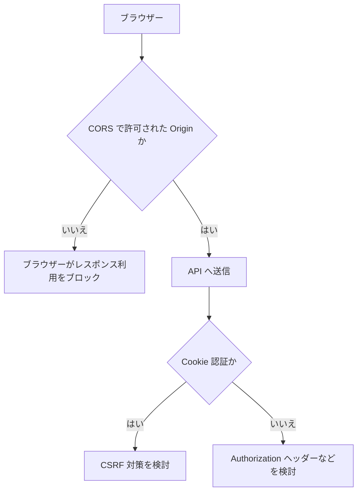

# CORS と CSRF

CORS は、ブラウザーが異なるオリジンへのリクエストを制限する仕組みです。

API 側で許可するオリジンを設定します。

```csharp
policy.WithOrigins("https://example.com")
      .AllowAnyHeader()
      .AllowAnyMethod();
```

CSRF は、ログイン済みユーザーのブラウザーを悪用して、意図しないリクエストを送らせる攻撃です。

Cookie 認証を使う場合は CSRF 対策を考えます。Bearer トークンを `Authorization` ヘッダーで送る API では、Cookie 認証とはリスクの形が変わります。

CORS は CSRF 対策そのものではありません。

また、CORS は認可の代わりにもなりません。CORS で許可していない Origin からでも、ブラウザー以外のクライアントやサーバー間通信では API を呼べます。

「許可した画面からしか呼ばれないはず」と考えるのではなく、API 側で認証・認可を必ず確認します。



CORS は「ブラウザーが別オリジンのレスポンスを利用してよいか」の制御です。CSRF は「ユーザーの意図しないリクエストを送らせる攻撃」への対策です。
