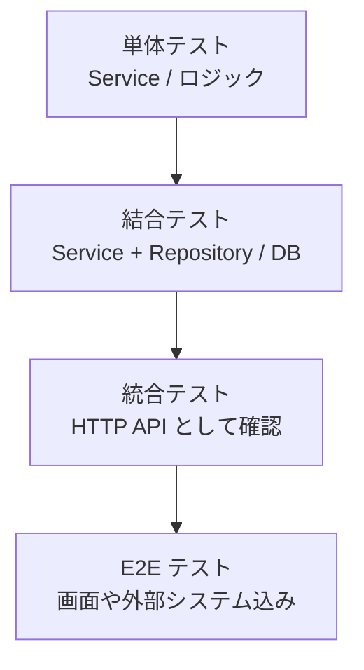

# 単体テストと結合テストと統合テスト

テストは「何を確認したいか」で分けます。名前だけで覚えるより、**どの境界まで通すか** で考えると整理しやすいです。

| 種類 | 主に見るもの | HTTP | DB |
| --- | --- | --- | --- |
| 単体テスト | 1 つのクラスや関数のロジック | 通さない | 基本使わない |
| 結合テスト | アプリ内部の複数部品の接続 | 通さないことが多い | 使うことがある |
| 統合テスト | API として外から見た振る舞い | 通す | 使うことが多い |
| E2E テスト | 利用者の操作に近い一連の流れ | 通す | 使うことが多い |

## 単体テスト

単体テストは、ビジネスロジックや小さな判断だけを確認するテストです。

対象になりやすいもの:

- Service の条件分岐
- 計算ロジック
- 権限判定ロジック
- 日付判定
- バリデーション補助処理

DB、HTTP、ファイル、外部 API などは基本的に使いません。必要な依存はモックやスタブに置き換えます。

単体テストで確認したいのは、**入力に対して期待した判断を返すか** です。

## 結合テスト

結合テストは、アプリ内部の複数部品がつながって動くかを確認するテストです。

対象になりやすいもの:

- Service + Repository
- Repository + DbContext
- EF Core + テスト DB
- 外部 API クライアント + モックサーバー
- DI 設定の一部確認

HTTP 入口までは通さないことも多いです。例えば Service を直接呼び出し、その裏で Repository とテスト DB が正しく動くかを見るようなテストです。

結合テストで確認したいのは、**部品を組み合わせたときに期待通り動くか** です。

## 統合テスト

統合テストは、API として外から見た振る舞いを確認するテストです。

ASP.NET Core では `WebApplicationFactory` を使い、`HttpClient` で実際に HTTP リクエストを投げる形が代表です。

対象になりやすいもの:

- `GET /api/articles`
- `POST /api/articles`
- `PUT /api/articles/{id}`
- `DELETE /api/articles/{id}`
- 認証あり API
- バリデーションエラー
- `404 Not Found`
- `409 Conflict`
- 例外ハンドリング

統合テストで確認したいのは、**クライアントから見て API の契約通りに動くか** です。

## 呼び方はチームで揺れる

結合テストと統合テストの呼び方は、チームや会社によって揺れます。

そのため、テスト方針では名前だけでなく、次の観点を明記すると誤解が減ります。

- HTTP を通すか
- 本物に近い DB を使うか
- 外部 API をモックするか
- DI コンテナーを使うか
- どこまでを 1 つのテストで確認するか



下に行くほど本物に近い確認になりますが、遅く壊れやすくなります。上に行くほど速く安定しますが、組み合わせの保証は弱くなります。

## E2E テスト

E2E テストは End to End の略で、利用者に近い一連の流れを確認するテストです。

Web API だけのリポジトリでは、API を複数呼び出して業務シナリオを確認する形になります。

```text
ユーザー登録
ログイン
記事作成
記事一覧取得
記事更新
記事削除
```

フロントエンドも含むシステムでは、ブラウザー操作まで含めて確認することがあります。

E2E テストは本物に近い安心感がありますが、遅く不安定になりやすいため、数を絞って重要なシナリオに使います。
