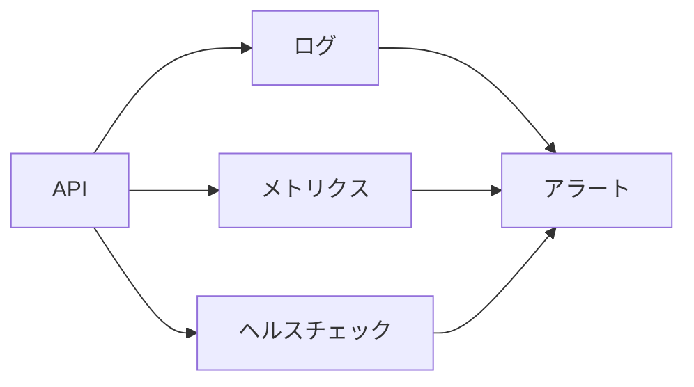

# 監視

監視は、アプリが正常に動いているかを継続的に確認することです。

見る対象:

- API の生存状態
- エラー率
- レスポンス時間
- CPU やメモリ
- DB 接続
- 外部サービスの失敗
- ログの異常な増加

ヘルスチェックは「今応答できるか」を見るための入口です。

ログは「何が起きたか」を調べるために使います。

メトリクスは「どのくらい起きているか」を見るために使います。

運用では、障害が起きた後に気づくのではなく、利用者影響が大きくなる前に検知できることが重要です。

