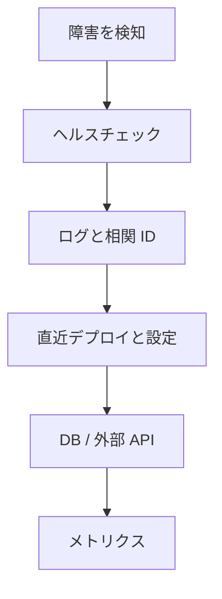

# 障害時に見る順番

障害対応では、何から確認するかを決めておくと調査が速くなります。

見る順番の例:

1. ヘルスチェックで API が応答しているか
2. エラー率とレスポンス時間が増えているか
3. 相関 ID で対象リクエストのログを追えるか
4. 直近デプロイや設定変更があるか
5. 接続文字列、環境変数、ログレベルなどの設定が正しいか
6. DB や外部 API に障害や遅延があるか
7. メトリクスで CPU、メモリ、接続数が詰まっていないか

ログ、メトリクス、ヘルスチェックはそれぞれ役割が違います。1 つだけで判断せず、組み合わせて原因を絞ります。
